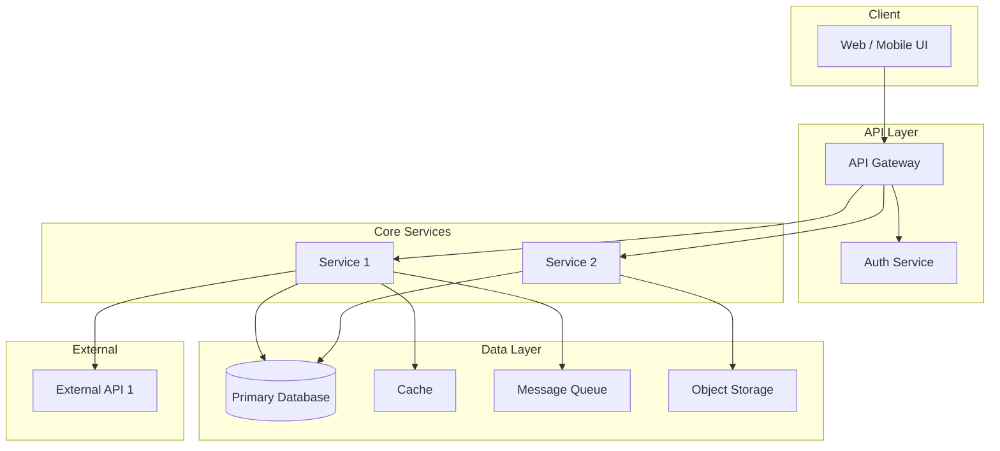
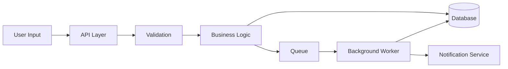

# ARCHITECTURE.md — [Project Name]

**Version:** 1.0
**Date:** YYYY-MM-DD
**Author:** [name]
**Status:** Draft | Review | Accepted
**PRD:** [link or path to PRD]

---

## 1. High-level component diagram

_Replace the above with your actual component topology. Every box must map to a module in CONTEXT.md or a service in deployment._

---

## 2. Service / platform selection rationale

| Component | Technology | Why this over alternatives | Cloud-specific? |
|---|---|---|---|
| _Primary database_ | _e.g. PostgreSQL_ | _reason_ | _No / Azure SQL / RDS / Cloud SQL_ |
| _Cache_ | _e.g. Redis_ | _reason_ | _No / Azure Cache / ElastiCache / Memorystore_ |
| _Message queue_ | _e.g. RabbitMQ_ | _reason_ | _No / Service Bus / SQS / Pub/Sub_ |
| _Object storage_ | _e.g. S3-compatible_ | _reason_ | _No / Azure Blob / S3 / GCS_ |
| _API framework_ | _e.g. ASP.NET / Express / FastAPI_ | _reason_ | _No_ |

**Cloud platform:** [Azure / AWS / GCP / multi-cloud / none]
**Cloud-specific decisions:** See `tasks/cloud-context.md` for org defaults (if present).

---

## 3. Cost-at-scale estimates

### Steady-state (monthly)

| Resource | Unit | Quantity | Unit cost | Monthly total |
|---|---|---|---|---|
| _Compute_ | _vCPU-hours_ | _N_ | _$X_ | _$Y_ |
| _Database_ | _GB-months_ | _N_ | _$X_ | _$Y_ |
| _Storage_ | _GB-months_ | _N_ | _$X_ | _$Y_ |
| _Egress_ | _GB_ | _N_ | _$X_ | _$Y_ |
| **Total** | | | | **$Z/month** |

### Burst scenario

| Trigger | Impact | Cost delta | Mitigation |
|---|---|---|---|
| _e.g. 10x traffic spike_ | _autoscale to N instances_ | _+$X/hour_ | _max instance cap, queue backpressure_ |

### Unit economics

| Metric | Value |
|---|---|
| Cost per user per month | $X |
| Cost per transaction | $X |
| Break-even point | N users / N transactions |

---

## 4. Data architecture

### Storage tiers

| Tier | Technology | What lives here | Retention | Backup |
|---|---|---|---|---|
| _Hot_ | _PostgreSQL_ | _active user data_ | _indefinite_ | _daily snapshots_ |
| _Warm_ | _Object storage_ | _archived records_ | _1 year_ | _cross-region replication_ |
| _Cold_ | _Glacier / Archive_ | _compliance records_ | _7 years_ | _immutable_ |

### Data flow diagram

_Replace with your actual data flow. Highlight regulated data paths (PHI/PII) with a different color or annotation._

### Partitioning strategy

| Table / Collection | Partition key | Shard strategy | Growth rate |
|---|---|---|---|
| _users_ | _tenant_id_ | _hash_ | _~N rows/month_ |

---

## 5. Scalability model

| Dimension | Current | 10x | 100x | Bottleneck at scale |
|---|---|---|---|---|
| _Concurrent users_ | _N_ | _N_ | _N_ | _e.g. DB connection pool_ |
| _Requests/sec_ | _N_ | _N_ | _N_ | _e.g. API gateway throughput_ |
| _Storage growth_ | _N GB/month_ | _N_ | _N_ | _e.g. cost of hot storage_ |

**Horizontal scaling strategy:** [how services scale out]
**Vertical scaling limits:** [where vertical scaling hits a ceiling and why]

---

## 6. Security architecture

### Identity and access

| Layer | Mechanism | Details |
|---|---|---|
| _User auth_ | _e.g. OAuth 2.0 / OIDC_ | _provider, token type, expiry_ |
| _Service-to-service_ | _e.g. mTLS / API keys_ | _rotation policy_ |
| _Admin access_ | _e.g. RBAC_ | _roles, least-privilege policy_ |

### Data classification

| Classification | Examples | Encryption at rest | Encryption in transit | Access control |
|---|---|---|---|---|
| _Regulated (PHI/PII)_ | _SSN, DOB, member IDs_ | _AES-256_ | _TLS 1.2+_ | _role-based, audit-logged_ |
| _Internal_ | _business logic, configs_ | _volume encryption_ | _TLS 1.2+_ | _team access_ |
| _Public_ | _marketing content_ | _none_ | _TLS_ | _open_ |

### Secret handling

| Secret type | Storage | Rotation | Access audit |
|---|---|---|---|
| _API keys_ | _Key vault / Secrets Manager_ | _90 days_ | _yes_ |
| _DB credentials_ | _Key vault / Secrets Manager_ | _90 days_ | _yes_ |
| _Certificates_ | _Managed cert service_ | _auto-renew_ | _yes_ |

**Compliance Owner sign-off** _(required if regulated data is in scope)_:
- Privacy Officer: _________________ Date: _________
- Security Lead: _________________ Date: _________

---

## 7. Observability plan

### Metrics

| Metric | Type | Alert threshold | Dashboard |
|---|---|---|---|
| _Request latency p95_ | _histogram_ | _> 500ms_ | _API health_ |
| _Error rate_ | _counter_ | _> 1%_ | _API health_ |
| _Queue depth_ | _gauge_ | _> 1000_ | _Processing health_ |

### Logging

| Service | Log level | Structured? | Retention | Sensitive data policy |
|---|---|---|---|---|
| _API_ | _Info_ | _Yes (JSON)_ | _30 days_ | _No PHI/PII in logs_ |

### Tracing

| Span | Propagation | Sampling rate |
|---|---|---|
| _HTTP requests_ | _W3C Trace Context_ | _1% production, 100% staging_ |

---

## 8. Disaster recovery

| Metric | Target | Current | Gap |
|---|---|---|---|
| **RTO** (Recovery Time Objective) | _e.g. < 1 hour_ | _e.g. ~2 hours_ | _need automated failover_ |
| **RPO** (Recovery Point Objective) | _e.g. < 5 minutes_ | _e.g. ~15 minutes_ | _need more frequent replication_ |

### Failure scenarios and recovery

| Scenario | Impact | Detection | Recovery procedure | Tested? |
|---|---|---|---|---|
| _Primary DB failure_ | _service down_ | _health check_ | _failover to replica_ | _yes/no_ |
| _Region outage_ | _full outage_ | _external monitor_ | _DNS failover to secondary region_ | _yes/no_ |
| _Data corruption_ | _data loss_ | _integrity checks_ | _point-in-time restore_ | _yes/no_ |

---

## Appendix: Decision log

Major architecture decisions made during this document's creation. Full ADRs live in `docs/adr/`.

| Decision | Rationale | ADR |
|---|---|---|
| _e.g. chose PostgreSQL over MongoDB_ | _relational data model, ACID compliance needed_ | _ADR-NNNN_ |
