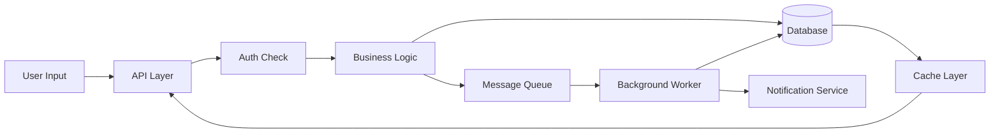
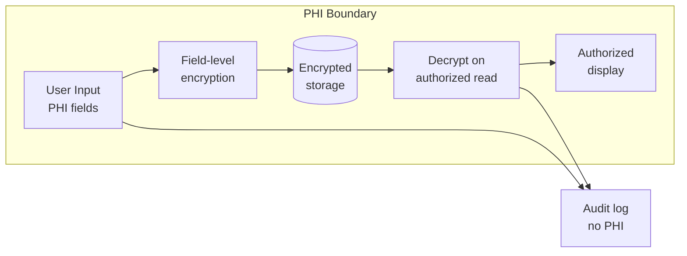

# Data Flow

**Project:** [project name]
**Last updated:** YYYY-MM-DD
**Source:** ARCHITECTURE.md Section 4 (Data architecture)

---

## System data flow

_Replace with your actual data flow. Annotate regulated data paths._

---

## Data lifecycle

| Stage | Where | Retention | Encryption | Access control |
|---|---|---|---|---|
| Ingestion | API layer | N/A | TLS in transit | Auth required |
| Processing | Service layer | In-memory only | N/A | Service identity |
| Storage (hot) | Primary database | [retention] | At rest: [method] | Role-based |
| Storage (warm) | Archive storage | [retention] | At rest: [method] | Restricted |
| Storage (cold) | Compliance archive | [retention] | At rest: [method] | Audit-only |

---

## Regulated data paths

_Every path where PHI/PII flows must be documented here._

| Data type | Classification | Source | Destination | Protection | Audit |
|---|---|---|---|---|---|
| [e.g. SSN] | PHI | User input | Database | Encrypted field, TLS | Access logged |
| [e.g. Email] | PII | Registration | Database + Email service | TLS | Access logged |

### Regulated data flow diagram

---

## External data integrations

| Integration | Direction | Data exchanged | Protocol | Auth | Regulated? |
|---|---|---|---|---|---|
| [External API] | Outbound | [data type] | HTTPS | API key | Yes / No |
