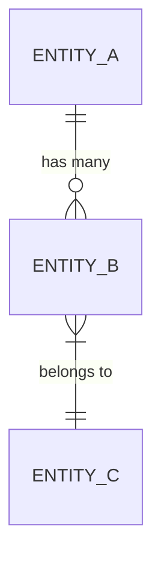

# Database Schema

**Project:** [project name]
**Last updated:** YYYY-MM-DD
**Source:** ARCHITECTURE.md Section 4 (Data architecture)

---

## Entity relationship diagram

---

## Entities

### [Entity Name]

| Field | Type | Nullable | Default | Constraints | Notes |
|---|---|---|---|---|---|
| id | UUID | No | auto | PK | |
| created_at | timestamp | No | now() | | |

**Indexes:**
- `idx_entity_field` on `field` — used by [query/endpoint]

**Relationships:**
- Has many `[related entity]` via `entity_id` FK

---

## Regulated data fields

| Entity | Field | Classification | Protection |
|---|---|---|---|
| | | PHI / PII / Internal | Encrypted at rest, audit-logged |

---

## Migration notes

_Document schema changes, migration ordering, and rollback procedures here._
