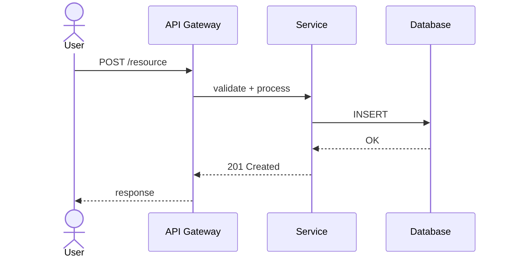
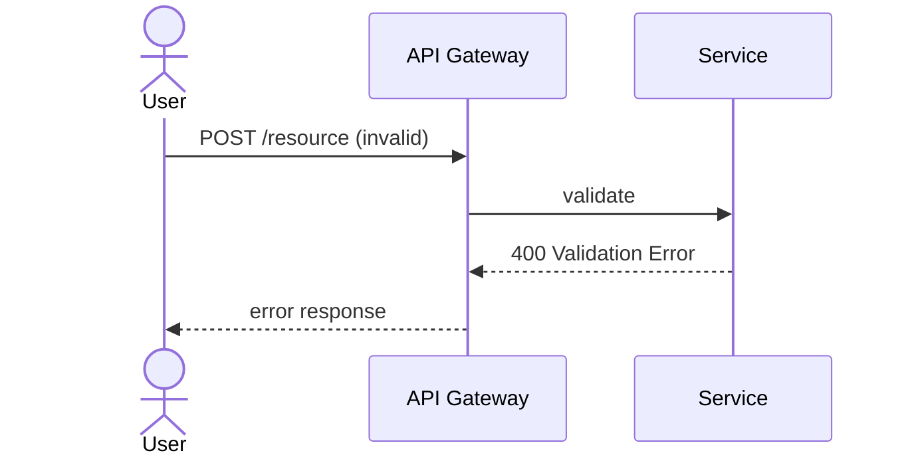
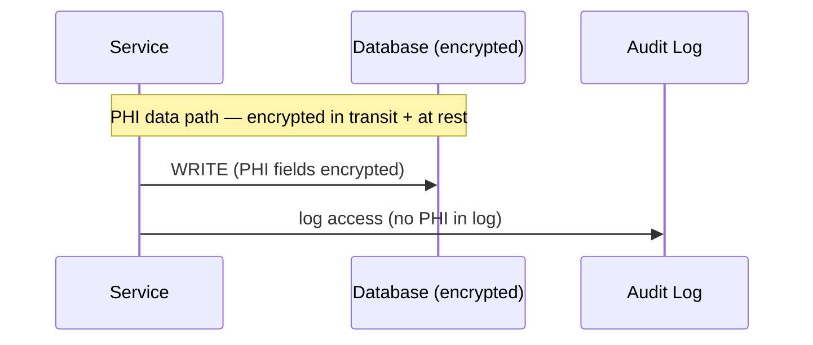

# Sequence Diagrams

**Project:** [project name]
**Last updated:** YYYY-MM-DD
**Source:** ARCHITECTURE.md component diagram + PRD user flows

---

## Key flows

### [Flow Name] — [one-line description]

**Trigger:** [what initiates this flow]
**Actors:** [user, service, external system]

**Notes:**
- [Any important detail about this flow — timeouts, retry behavior, async steps]

---

### [Error / Edge Case Flow]

---

## Regulated data flows

_Flows involving PHI/PII should be documented separately with data classification annotations._

### [Regulated Flow Name]

