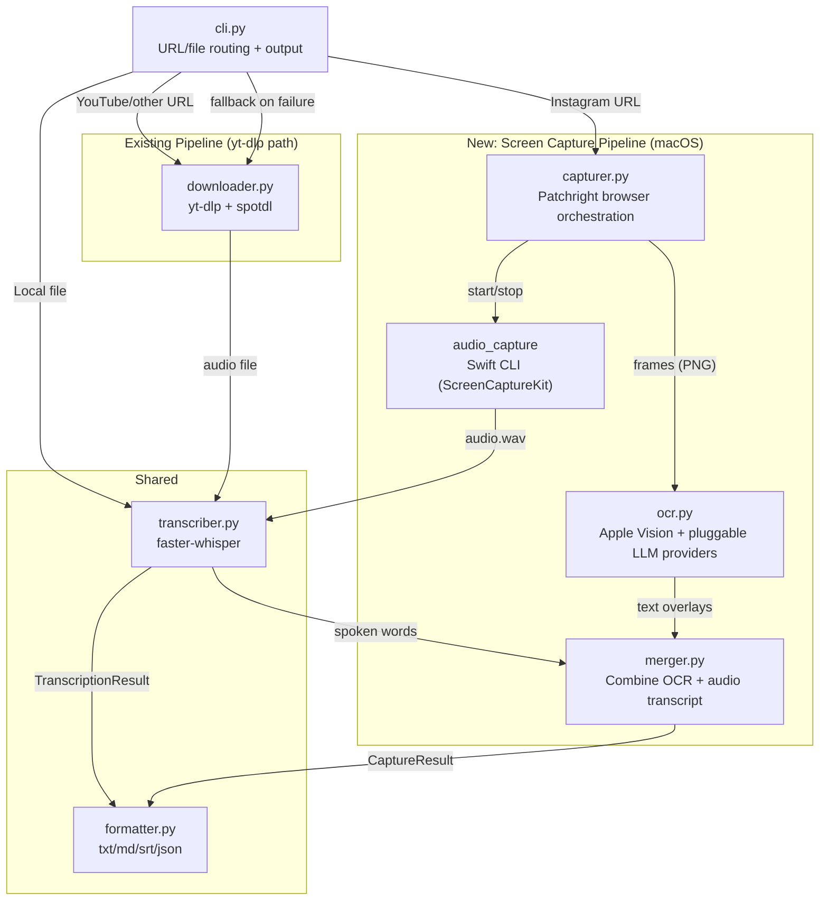
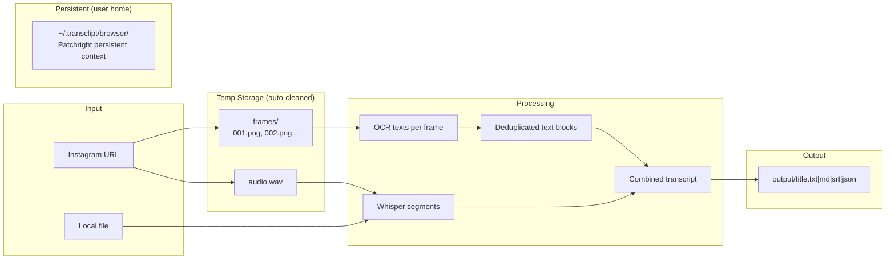

# Architecture: Screen-Capture Instagram Reel Transcription

**Status:** Draft
**Date:** 2026-06-11
**PRD:** [PRD-screen-capture.md](PRD-screen-capture.md)

---

## 1. High-Level Component Diagram



### Routing Logic

| Input | Primary Pipeline | Fallback |
|---|---|---|
| Instagram URL | Screen capture (Patchright + OCR + audio) | yt-dlp |
| YouTube URL | yt-dlp | None needed |
| TikTok, X, other URLs | yt-dlp | None needed |
| Spotify URL | spotdl (existing) | None needed |
| Local file path | Direct to transcriber (skip download) | N/A |

### Module Responsibilities

| Module | Responsibility |
|---|---|
| **cli.py** | Input detection (URL vs file vs domain), routing, output writing, progress display |
| **downloader.py** | Existing yt-dlp + spotdl download logic (unchanged) |
| **capturer.py** | Patchright browser lifecycle, Reel playback, frame capture at 1-2fps, audio capture orchestration |
| **ocr.py** | Frame-to-text extraction via pluggable providers, cross-frame text deduplication |
| **audio_capture (Swift CLI)** | ScreenCaptureKit app-scoped audio capture, outputs WAV file |
| **merger.py** | Combines OCR text blocks + Whisper segments into unified CaptureResult |
| **transcriber.py** | faster-whisper speech-to-text (shared by both pipelines) |
| **formatter.py** | Output formatting: txt, md, srt, json (shared by both pipelines) |

---

## 2. Technology Selection Rationale

| Component | Choice | Runner-up | Rationale |
|---|---|---|---|
| **Browser automation** | Patchright (v1.60.1) | Playwright + playwright-stealth | Patchright patches CDP detection signals at the Chromium level. Drop-in Playwright API but less detectable by Instagram. playwright-stealth only patches JS-level signals, misses CDP leaks. |
| **OCR (default)** | Apple Vision (`pyobjc-framework-Vision`) | Tesseract | Free, on-device, fast (~100ms/frame), good accuracy for clean text. Tesseract scores ~34% on modern benchmarks — too weak for styled Reel text. |
| **OCR (pluggable providers)** | Protocol-based interface | Hardcoded single provider | Users can choose: Apple Vision (free default), Claude Vision, GPT-4V, Gemini Vision, or local models via Ollama. API keys via environment variables. |
| **Audio capture** | ScreenCaptureKit via Swift CLI | BlackHole virtual audio device | ScreenCaptureKit captures audio from a specific app window — no bleed from notifications or other apps. BlackHole captures all system audio and requires manual Audio MIDI Setup. |
| **Swift CLI vs PyObjC for audio** | Swift CLI (subprocess) | pyobjc-framework-ScreenCaptureKit | PyObjC bindings for ScreenCaptureKit have reported audio callback issues on recent macOS. Swift is the first-class citizen for Apple frameworks — more reliable, better documented. |
| **Speech-to-text** | faster-whisper (existing) | Apple SpeechAnalyzer (macOS 26) | Already a dependency, battle-tested, cross-platform. SpeechAnalyzer is brand new (WWDC 2025) — good future optimization but too new to rely on. |
| **Browser session persistence** | Patchright persistent context | Cookie export/import | Persistent context saves the full browser state (cookies, localStorage, IndexedDB). More complete than just cookies — handles Instagram's multi-layer session tracking. |
| **Frame dedup** | Fuzzy text matching (difflib) | Perceptual image hashing | We care about text content, not image similarity. Fuzzy string matching on OCR output is simpler, faster, and directly answers "is this new text?" |
| **Local file detection** | `Path.exists()` check before URL parsing | Separate `--file` flag | More natural UX. `transclipt ./video.mp4` just works — no new flag to learn. |

---

## 3. Cost Model

### Per-Transcription Cost

Everything runs locally. **Cost per transcription: $0** with the default (Apple Vision) OCR provider.

| Resource | Cost | Notes |
|---|---|---|
| Patchright/Chromium | Free (open source) | ~200-400MB RAM per capture session |
| Apple Vision OCR | Free (on-device) | No API calls |
| faster-whisper | Free (on-device) | First run downloads model (~150MB for base) |
| ScreenCaptureKit | Free (macOS built-in) | Requires screen recording permission grant |
| Swift CLI compile | One-time, ~5 seconds | At install time |

### Optional LLM OCR Providers (user opt-in)

| Provider | Cost per frame | Cost per 60s Reel (60 frames) |
|---|---|---|
| Apple Vision (default) | $0 | $0 |
| Claude Vision | ~$0.01-0.03 | ~$0.60-1.80 |
| GPT-4V / GPT-4o | ~$0.01-0.03 | ~$0.60-1.80 |
| Gemini Vision | ~$0.005-0.01 | ~$0.30-0.60 |
| Ollama (local) | $0 | $0 |

### CLI Flag

```
--ocr-model vision    # Apple Vision (default, free, on-device)
--ocr-model claude    # Claude Vision API
--ocr-model openai    # GPT-4V / GPT-4o
--ocr-model gemini    # Gemini Vision
--ocr-model ollama    # Local model (e.g., LLaVA, Moondream)
```

API keys sourced from environment variables: `ANTHROPIC_API_KEY`, `OPENAI_API_KEY`, `GOOGLE_API_KEY`.

---

## 4. Data Architecture

### Data Flow



### Storage Locations

| Path | Purpose | Lifetime | Permissions |
|---|---|---|---|
| `~/.transclipt/browser/` | Patchright persistent browser context (cookies, localStorage) | Until user clears or session expires | `700` (owner-only) |
| `/tmp/transclipt_*/frames/` | Captured PNG frames | Deleted after each run | Default |
| `/tmp/transclipt_*/audio.wav` | Captured audio | Deleted after each run | Default |
| `output/` | Final transcripts | Permanent (user's content) | Default |

### Key Data Decisions

- Browser session lives in `~/.transclipt/browser/`, not in the project directory — contains auth tokens, must never be committed
- Temp frames/audio cleaned up in a `finally` block (same pattern as existing tmp_dir cleanup in cli.py)
- API keys for LLM OCR providers come from environment variables, never stored in config files
- No persistent database — all state is filesystem-based

---

## 5. Scalability Model

| Dimension | 1 Reel | 10 Reels (batch) | 100 Reels |
|---|---|---|---|
| **Time** | ~75s (60s playback + 15s overhead) | ~12.5 min (sequential) | ~2 hours (sequential) |
| **RAM** | ~400MB (Chromium) + ~500MB (Whisper base) | Same — one at a time | Same |
| **Disk (temp)** | ~50MB (frames + audio) | ~50MB (cleaned between runs) | ~50MB |
| **Disk (output)** | ~5KB per transcript | ~50KB | ~500KB |

### Bottlenecks

| Scale | Bottleneck | Mitigation |
|---|---|---|
| 1 Reel | Real-time playback (inherent to screen capture) | None needed |
| 10 Reels | Wall-clock time (sequential) | Existing batch mode: `transclipt url1 url2 url3` runs sequentially |
| 100 Reels | User patience | Out of scope. Future: parallel browser instances (2-3 concurrent) |

**Design target:** 1-5 Reels per session. The "second brain" use case does not require bulk processing.

---

## 6. Security Architecture

| Concern | Approach |
|---|---|
| **Instagram session cookies** | Stored in `~/.transclipt/browser/` with `700` file permissions (owner-only). Never committed to git. |
| **LLM API keys** | Environment variables only (`ANTHROPIC_API_KEY`, `OPENAI_API_KEY`, etc.). Never stored in config files, never logged. |
| **Captured frames/audio** | Temp directory, deleted after each run in `finally` block. Contains other people's content — must not persist. |
| **Screen recording permission** | macOS prompts on first run. ScreenCaptureKit requires explicit user consent via System Settings. No bypass. |
| **Swift CLI helper** | Compiled locally from source at install time. User can audit the code. No pre-built binary downloaded from the internet. |
| **Subprocess calls** | Swift CLI invoked with fixed arguments, no user input interpolated into command strings. No injection risk. |

### .gitignore Additions

The project `.gitignore` must include:
```
output/
```

The `~/.transclipt/` directory is outside the repo and not at risk of accidental commit.

**No regulated data (PHI/PII)** in scope. This tool processes public social media content for personal use.

---

## 7. Observability Plan

For a CLI tool, observability = clear user feedback.

| Aspect | Approach |
|---|---|
| **Progress feedback** | Rich progress spinner (existing pattern) with stage labels: "Opening browser..." → "Playing Reel..." → "Capturing frames..." → "Running OCR..." → "Transcribing audio..." → "Merging transcript..." |
| **Verbose mode** | `--verbose` flag: prints frame count, OCR confidence per frame, Whisper language detection, dedup stats, timing per stage |
| **Error messages** | Actionable, not cryptic. E.g., "Patchright not installed. Run: `pip install transclipt[capture]`" or "Instagram session expired. Run: `transclipt --login` to re-authenticate" |
| **Logging** | Python `logging` module at DEBUG level. Hidden by default, shown with `--verbose`. No sensitive data in logs (no cookies, no session tokens). |

---

## 8. Failure Recovery

| Failure Scenario | Detection | Recovery |
|---|---|---|
| **Browser crashes mid-capture** | Patchright throws exception | `finally` block cleans up temp files. User re-runs. No corrupted state. |
| **Instagram session expires** | Login wall detected during page load | Print "Session expired. Run: `transclipt --login`." Fall back to yt-dlp for this run. |
| **Swift audio helper fails** | Subprocess returns non-zero exit | Skip audio capture, continue with OCR-only transcript. Warn: "Audio capture unavailable — transcript contains text overlays only." |
| **ScreenCaptureKit permission denied** | macOS permission error | Print "Grant screen recording permission in System Settings > Privacy & Security." |
| **Patchright not installed** | ImportError at startup | Print "Screen capture requires Patchright. Run: `pip install transclipt[capture]`". Fall back to yt-dlp. |
| **Browser state corrupted** | Patchright fails to launch | Delete `~/.transclipt/browser/`, print "Browser state reset. Run `transclipt --login` to log in again." |
| **Disk full during capture** | IOError on frame/audio write | Clean up temp dir, print error. No partial output written. |

**Key principle:** Every failure either falls back gracefully (capture → yt-dlp) or gives the user a one-line fix command. No run leaves corrupted state — temp files always cleaned up.

---

## New Dependencies

### Required (capture extra)

```toml
[project.optional-dependencies]
capture = [
    "patchright>=1.60.0",
    "pyobjc-framework-Vision>=12.0",
]
```

Installed via: `pip install transclipt[capture]`

### System Requirements (macOS only)

| Requirement | Version | Purpose |
|---|---|---|
| macOS | 14+ | ScreenCaptureKit audio capture |
| Xcode Command Line Tools | Any recent | Compile Swift audio helper |
| ffmpeg | Any recent | Audio format conversion (existing requirement) |

### New CLI Flags

| Flag | Values | Default | Purpose |
|---|---|---|---|
| `--method` | `auto`, `capture`, `ytdlp` | `auto` | Override platform routing |
| `--ocr-model` | `vision`, `claude`, `openai`, `gemini`, `ollama` | `vision` | OCR provider for screen capture |
| `--verbose` | flag | off | Show detailed progress and timing |
| `--login` | flag | off | Open headed browser for Instagram login |
| `--headed` | flag | off | Force visible browser (debug/fallback) |

### New Data Types

```python
@dataclass(frozen=True)
class CaptureResult:
    """Result from screen capture pipeline."""
    ocr_texts: tuple[OcrBlock, ...]      # Deduplicated text overlays
    transcription: TranscriptionResult | None  # Whisper result (None if audio capture failed)
    title: str
    source_url: str

@dataclass(frozen=True)
class OcrBlock:
    """A deduplicated block of text from OCR."""
    text: str
    confidence: float
    first_seen_at: float  # Timestamp in video when text first appeared

class OcrProvider(Protocol):
    """Pluggable OCR provider interface."""
    def extract_text(self, frame_path: Path) -> list[OcrBlock]: ...
```

---

## File Structure (After Implementation)

```
transclipt/
├── __init__.py
├── cli.py               # Updated: routing logic, new flags
├── downloader.py         # Unchanged
├── transcriber.py        # Unchanged
├── formatter.py          # Updated: handle CaptureResult
├── capturer.py           # NEW: Patchright browser orchestration
├── ocr.py                # NEW: OCR providers + dedup
├── merger.py             # NEW: combine OCR + Whisper
└── audio_capture/        # NEW: Swift CLI source
    ├── main.swift
    └── build.sh
tests/
├── test_cli.py           # Updated: new routing tests
├── test_downloader.py    # Unchanged
├── test_transcriber.py   # Unchanged
├── test_formatter.py     # Updated: CaptureResult formatting
├── test_capturer.py      # NEW
├── test_ocr.py           # NEW
└── test_merger.py        # NEW
```
